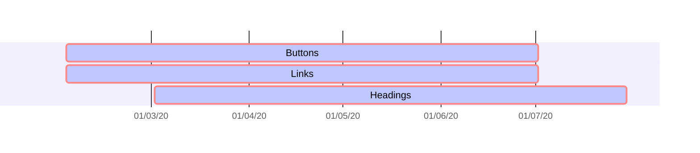

# Long time support

---

<timeline>

<timelineItem 
    type="danger"
    date="10 July 2020"
    title="End of LTS for legacy Buttons"
    text="We now ue the CSS classes of Mozaic buttons. You have until this date to update your applications."
    linklabel="Buttons documentation"
    linkhref="/pages/components/buttons/"
/>

<timelineItem
    type="warning"
    date="10 July 2020"
    title="End of LTS for legacy Links"
    text="We now use the CSS classes of Mozaic links. You have until this date to update your applications."
    linklabel="Links documentation"
    linkhref="#"
/>

<timelineItem
    type="danger"
    date="02 august 2020"
    title="End of LTS for legacy Titles"
    text="We now use the CSS classes of Mozaic headings. You have until this date to update your applications."
    linklabel="Title documentation"
    linkhref="#"
/>

</timeline>